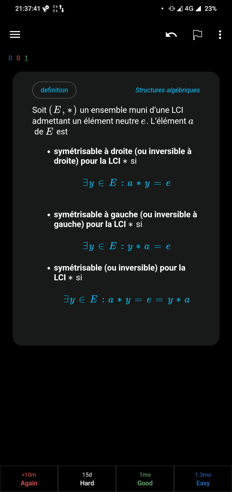
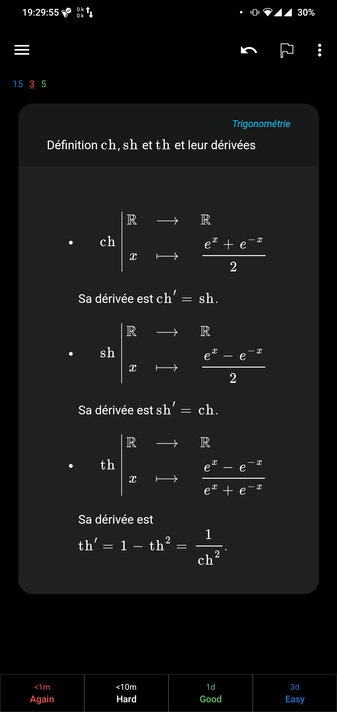
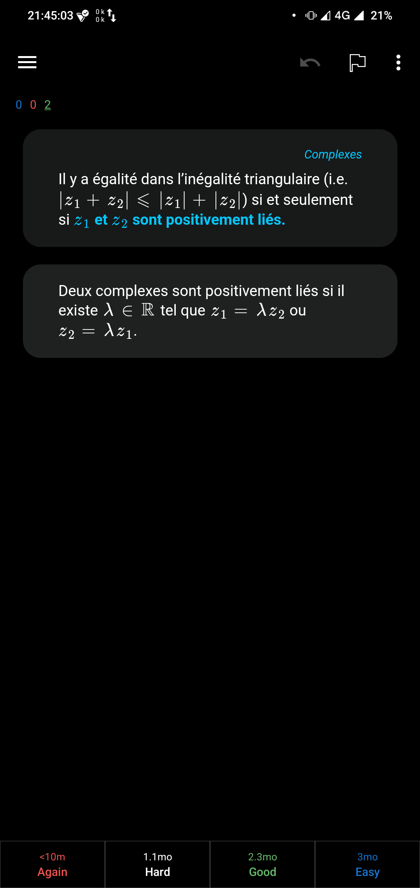
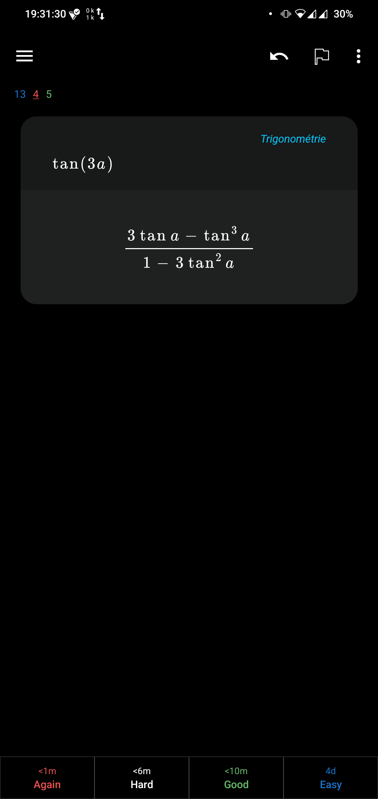

# My Anki card style

The card templates I use to make my Anki look nice. They also include my MathJax macros.

> [!NOTE]
> The MathJax macros will not work in the editor view but will be correctly rendered in the preview and learning views.

## Screenshots
<table>
  <tr>
    <td> </td>
    <td></td>
    <td></td>
    <td></td>
  </tr>
 </table>

## Usage

### Anki desktop

- In the card browser, go to `Notes`, `Manage Note Type`
- Choose a card type from the list and then click on `Cards`
- A popup will appear with three tabs, one for the front, another for the back and a third for the CSS style.
- For the `Basic`/`Basic (and reversed card)`/`Basic (optional reversed card)` note type, copy-paste the content of `basic/front.html` in the first tab, the content of `basic/back.html` in the second and the content of `basic/styles.css` in the third.
> [!IMPORTANT]
> Be sure to update all card variations (dropdown at the top of the popup) for the note types involving the creation of multiple cards.
- For the `Cloze` or `Basic (and reversed card)` note type, same but with the relevant folder.

### AnkiDroid

You can access the card edition screen by tapping on the three dots at the upper right corner of the screen, and then choosing the `Manage note types` option.
